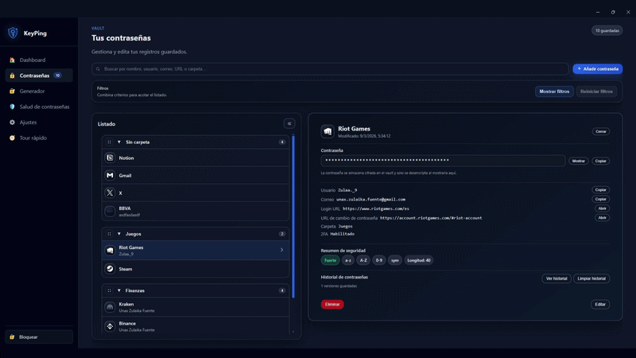
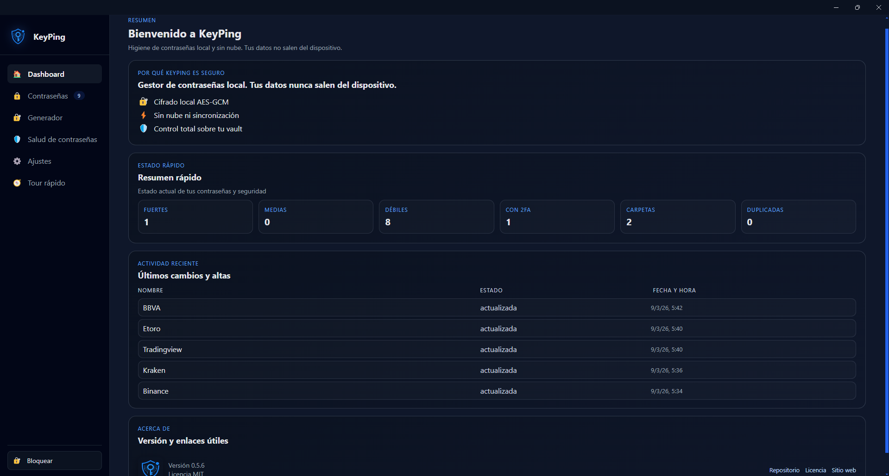
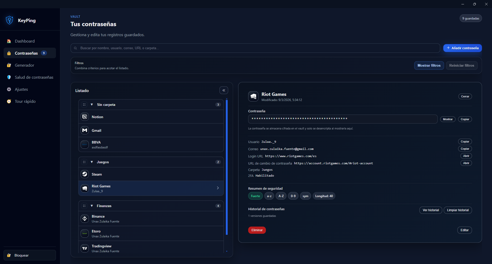
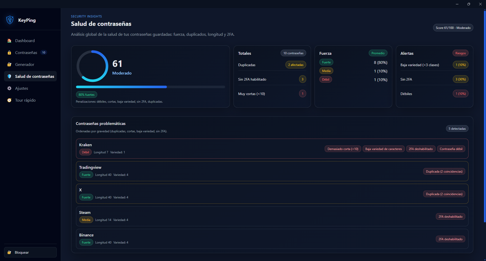
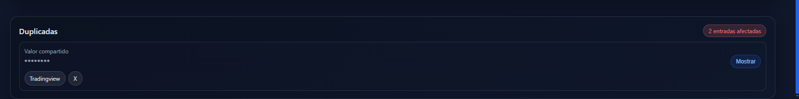
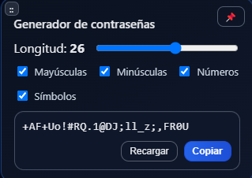
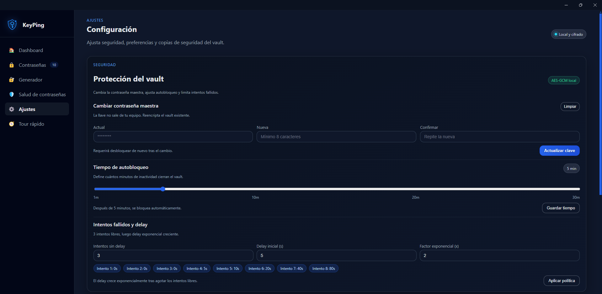
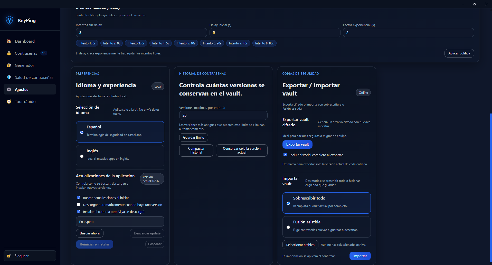

# KeyPing

[English](./README.md) | [Espanol](./README.es.md)

**KeyPing es un gestor de contrasenas de escritorio centrado en privacidad, enfocado en detectar contrasenas debiles, reutilizadas y riesgosas, manteniendo todos los datos en local y offline.**

[](https://github.com/Unax-Zulaika-Fuente/KeyPing/releases)
[](https://github.com/Unax-Zulaika-Fuente/KeyPing/releases)
[](./keyping-ui)
[](./LICENSE)

## Estado del proyecto

Desarrollo activo. Las funcionalidades base son estables y se estan mejorando de forma continua en UX, seguridad y cobertura de tests.

## Capturas

### Flujo demo











## Funcionalidades

- Boveda cifrada solo local (AES-256-GCM)
- Deteccion de similitud y reutilizacion de contrasenas
- Analisis y puntuacion de salud de contrasenas
- Historial de versiones por contrasena
- Busqueda y filtros avanzados
- Organizacion por carpetas con drag and drop
- Portapapeles seguro con auto-limpieza y limpieza de historial (Windows en modo best effort)
- Importacion/exportacion cifrada en modo offline
- Auto-actualizaciones via GitHub Releases
- Onboarding interactivo y modo demo
- Interfaz ES / EN

## Por que KeyPing

La mayoria de gestores de contrasenas se centran en almacenamiento y autocompletado.

KeyPing se centra en higiene de contrasenas:

- detectar contrasenas debiles
- identificar credenciales reutilizadas
- destacar patrones de riesgo
- mejorar la seguridad del vault con el tiempo

Todo manteniendo los datos en local y offline.

## Seguridad

### Cifrado local

La boveda se cifra en disco con AES-256-GCM.

### Sin dependencia de nube

No requiere sincronizacion cloud obligatoria, ni almacenamiento externo de secretos, ni cuenta.

### Derivacion PBKDF2

La derivacion usa PBKDF2-HMAC-SHA512 (`120000` iteraciones en la implementacion actual).

### Auto-limpieza del portapapeles

Los secretos copiados se limpian tras el timeout solo si el contenido actual sigue coincidiendo con el secreto copiado.

### Proteccion frente a fuerza bruta

El bloqueo maestro aplica retardos progresivos tras intentos fallidos de desbloqueo.

### Checks de integridad de boveda

La app valida estructura de boveda y detecta anomalias/corrupcion de timestamps.

## Instalacion

Descarga binarios desde GitHub Releases:

- Releases: https://github.com/Unax-Zulaika-Fuente/KeyPing/releases
- Windows: instalador `.exe` (NSIS)
- Linux: `AppImage`
- macOS: `.dmg`

## Integridad de releases

Cada release incluye checksums SHA256 para verificar la integridad de los binarios.

## Arquitectura

- **Frontend**: Angular (componentes standalone)
- **Runtime de escritorio**: Electron
- **Puente IPC**: preload seguro (`contextIsolation` activado)
- **Boveda**: archivo local cifrado gestionado por el proceso principal de Electron

Resumen de flujo:

1. La UI solicita acciones a traves del IPC del preload.
2. El proceso principal valida y ejecuta operaciones seguras.
3. El modulo de boveda cifra/descifra almacenamiento local.
4. La UI recibe metadatos saneados y estado de operacion.

## Desarrollo

Requisitos:

- Node.js 20+
- npm 10+

Ejecucion local:

```bash
cd keyping-ui
npm install
npm run dev
```

Comandos utiles:

- `npm run build` -> build de produccion + empaquetado
- `npm run test` -> tests de Angular
- `npm run test:electron` -> tests unitarios de Electron

## Roadmap

- Integraciones opcionales de breach-check (con enfoque de privacidad)
- Mayor cobertura de tests automaticos en IPC/boveda
- Mejor UX de resolucion de conflictos en importacion
- Pipeline de firma y notarizacion en macOS
- Modo portable opcional
- Mas mejoras de accesibilidad y navegacion por teclado

## Contribuir

Se aceptan issues y PRs.

Para reportar bugs, incluye:

- SO y version
- Version de KeyPing
- Pasos de reproduccion
- Comportamiento esperado vs actual

## Licencia

MIT. Consulta [LICENSE](./LICENSE).

## Terceros Y Marcas

- Avisos de terceros: [THIRD_PARTY_NOTICES.md](./THIRD_PARTY_NOTICES.md)
- Aviso de marca y branding: [TRADEMARK.md](./TRADEMARK.md)

## Autor

Unax Zulaika Fuente

- GitHub: https://github.com/Unax-Zulaika-Fuente
- Proyecto: https://github.com/Unax-Zulaika-Fuente/KeyPing
